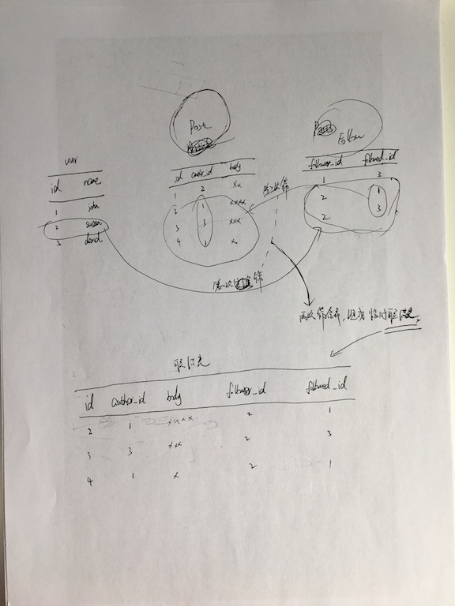

# 关注者
## 随便聊聊
这一章是关于好友关系的，关键点在于多对多的关系。

## 数据库关系
### 一对多关系
需要在「多」这一侧加入一个外键，指向「一」这一侧联结的记录。

举例：用户角色（一） & 用户（多）、用户（一） & 文章（多）

### 多对多关系
如果按之前的逻辑，加入的外键数应该和其被联结的东东数量一致。但是多对多意味着，被联结的东东的数量是不确定的

方案：找一个中间的东西，这个东西
1. 和学生是一（学生）对多（这个东西）
2. 和课程是一（课程）对多（这个东西）

思考一下，这个东西，其实就是「学生和课程的关系」的这么个东西。

「学生和课程的关系表」:由一个学生和一个课程的关系，所组成的表

上面的都是屁话，想不通的时候，可以回忆下「重构」那本书，回一下「一切皆对象」。
弄明白情景、弄明白问题、就容易思考解决方案了。很多时候不明白解决方案，往往是因为问题理解的不够深刻

### 自引用关系
表示用户之间的关注关系时，只有用户这一个实体...如何实现这种关系？

如果关系中的两侧，都在同一个表中，那么这种关系叫做自引用关系。 - 一种特殊的多对多关系，也可以用增加一个表的方式实现

### 高级多对多关系
按理来说，保存多对多关系的时候，新增的关系表，只要有两个字段就好：关注者id和被关注者id。

但是，如果在关系里面再增加一些属性，比如关系建立的时间，就可以按时间顺序列出所有关注者了。

为了能给关系追加属性，需要提升关联表的地位，而不是系统管理的内部表

用法参见：app/models/user.py

# 12.3首页只显示关注者的文章
## 学前思考
思考一下，如果想只显示关注者的文章，那么需要做的有：
1. 判断用户登录没有，有没有关注者
2. 拉当前用户的所有关注者，再通过关注者拉文章
3. 在首页展示...

再思考一下，这样做效率怎么样？好像比较低...要查两个表 - User表查关注者的用户id，Posts表通过id筛文章...
- 如果关注的人比较多怎么办？
- 文章比较多怎么办？
- 分页机制如何作用？

有没有什么好办法？

好了，思考结束，开始看书~

## 书中的引文
若想显示所关注用户发布的所有文章
1. 第一步显然先要获取这些用户
2. 然后获取各用户的文章
3. 再按一定顺序排列，写入单独数组

问题：
1. 这种方式的伸缩性不好，随着数据库不断变大，生成这个列表的工作量也不断增长
2. 分页等操作也无法高效率完成

解决方案：
获取博客文章的高效方式 -- *只用一次查询*

## 知识点 - 联结
联结：作用到两个或更多的数据表，在其中查找满足指定条件的记录组合，再把记录组合插入一个临时表中。这个临时表就是联结查询的结果


## 联结的用法说明
```
return db.session.query(Post).select_from(Follow).\ filter_by(follower_id=self.id).\
join(Post, Follow.followed_id == Post.author_id)
```
- db.session.query(Post) 这个查询要返回Post对象
- select_from(Follow) 这个查询从Follow模型开始
- filter_by(follower_id=self.id) 过滤出来关注者是自己的关注关系
- join(Post, Follow.followed_id == Post.author_id) 把文章中的作者id和被关注者id相同的文章做联结

代码描述：
要获取文章，先从关注关系这个表里查，筛选出关注者id是自己id的关注关系，把被关注者id和文章的作者id做联结

简化：
这是一种以终为始的写法
```
return Post.query.join(Follow, Follow.followed_id == Post.author_id)\ .filter(Follow.follower_id == self.id)
```

简化和不简化两种操作方法，看起来不一样，其实是一样的。SQLAlchemy首先水机所有过滤器，然后再分析，以最高效的方式生成查询。
这两种方式，生成的原生SQL指令是一样的。

文章里说：联结非常难理解，你可能需要在shell中多研究一下示例代码才能完全领悟。
其实不仅联结，数据库这块，都需要好好捋一捋。现在每次更新数据库的结构，都需要删表再重建才能生效😂

